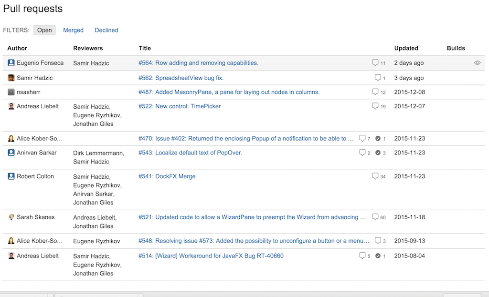

# Bitbucket pull requests overview chrome extension

Extension for Google Chrome which automatically add _Reviewers_ column to the overal pull requests page that can
be found at url _https://bitbucket.org/{organization}/{repository}/pull-requests_.

## Warning

This is a "quick and dirty" extension. 

It can make your browser slower (doing one ajax call for each pull request directly in content script).

This extension hasn't been thoroughly tested and can contain hidden bugs.

__Use it at your own risk!__

## Installation
 
 Extension is not available in Chrome Web Store. 

 The easiest way how to install plugin is to clone  repository and then drag and drop the root directory 
 onto chrome://extensions page in your Chrome browser.
 See [Getting Started: Building a Chrome Extension](https://developer.chrome.com/extensions/getstarted) for more details.

## Usage

Usually, you can use the extension right after the installation without any other tweaks.
Just visit the URL _https://bitbucket.org/{organization}/{repository}/pull-requests_ and the _Reviewers_ column should
be automatically added after the _Author_ column.

It can looks like this:

